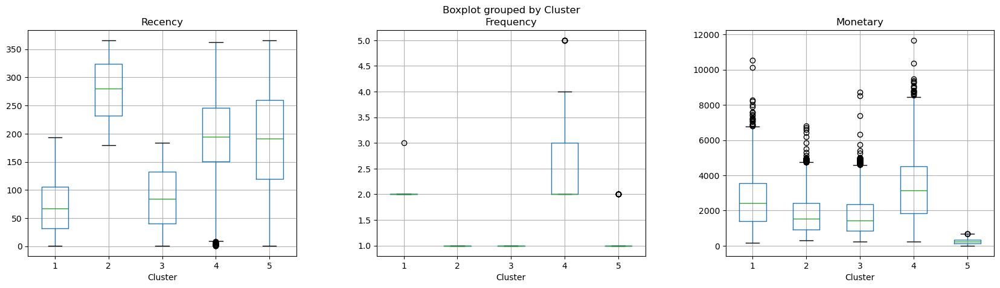
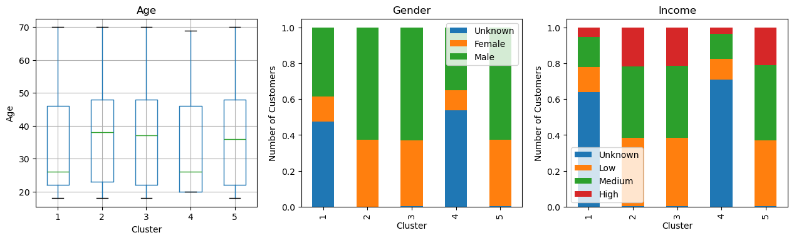

# Customer-Segmentation-Analysis
This project demonstrates a complete end-to-end customer segmentation analysis using the RFM (Recency, Frequency, Monetary) framework and K-means clustering. It showcases the process of data cleansing, feature engineering, and clustering to uncover actionable insights about customer purchasing behavior in the Canadian retail market. The results can help businesses design targeted marketing campaigns, strengthen customer retention, and improve profitability.

## Objective
The objective of this project is to identify distinct customer segments based on purchasing behavior using the Recency, Frequency, and Monetary (RFM) framework combined with the K-means clustering algorithm. The insights aim to inform data-driven marketing strategies, enhance customer retention, and improve overall profitability.

## Notebook Structure
The analysis in `notebook/Customer_Segmentation_Analysis.ipynb` is organized into the following sections:
1. Exploratory Data Analysis (EDA)
2. Data Preprocessing
3. K-means Clustering Model Development
4. Customer Profiling
5. Recommendations & Insights
6. Customer Segment Export

## Packages
The following Python packages were used in this project:
- NumPy  
- pandas  
- Matplotlib  
- Plotly  
- scikit-learn  

## Process
1. Retrieved customer demographic and transaction data and performed data cleansing and transformation using Python.  
2. Engineered Recency, Frequency, and Monetary (RFM) features and applied appropriate scaling and transformations to improve clustering quality.  
3. Implemented K-means clustering and developed customer segment profiles by integrating demographic and behavioral data.  
4. Exported customer IDs for each segment to CSV for future analysis and targeted campaign development.  

## Customer Segments
- **Cluster 1:** Big Spenders / Potential Loyalists  
- **Cluster 2:** New or Inactive Customers (depending on the business context)  
- **Cluster 3:** Low-Value Recent Buyers  
- **Cluster 4:** Loyal Customers  
- **Cluster 5:** Low-Value, Low-Engagement Customers  

## Actionable Insights
**High-Value and Loyal Customers (Clusters 1 & 4)**
- Cluster 1 & 4 represents younger customer groups with high spending and frequency purchases, indicating strong loyality potential.
- *Recommendation*: Focus on retention strategies such as loyalty programs, exclusive offers, and early access promotions.

**Growth Opportunities (Clusters 2 & 3)** 
- Older age with a male-skew profile. Income status is slightly unbalanced with more customers have low or medium income.
- *Recommendation*: Design re-engagement or onboarding campaigns (e.g., win-back offers, welcome discounts) to convert these customers into repeat buyers.

**Low-Value and Low-Engagement Customers (Cluster 5)** 
- Customers in this segment have low spendings and purchase frequency, making them low priority for high cost marketing campaigns.
- *Recommendation*: Implement low-cost marketing strategies such as newsletters or occasional promotions to maintain brand visibility with minimal cost.

## Visualizations

*Displays variations in Recency, Frequency, and Monetary (RFM) values across customer segments, highlighting behavioral differences among groups.*

*Illustrates the demographic characteristics of each customer segment by age, gender, and income distribution.*

## Limitations
- The analysis is limited by incomplete and inconsistent demographic data, particularly age, gender, and income.  
- It is recommended to collect more comprehensive demographic information during sign-up, checkout, or loyalty program enrollment to improve future segmentation and targeting.
